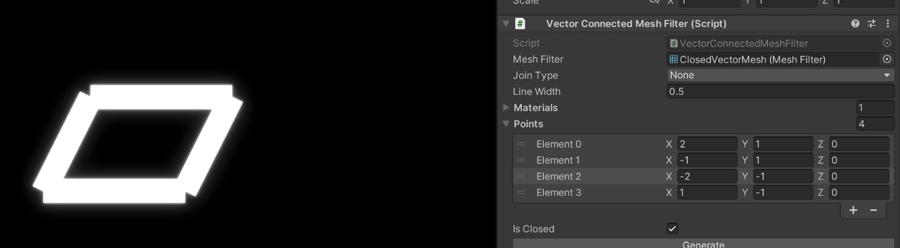
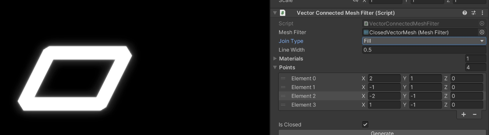
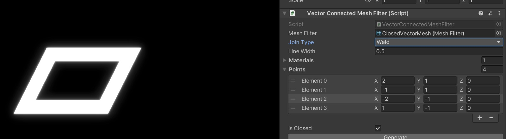

# VectorVanguard
Get ready to blast off with Vector Vanguard - a nostalgic tribute to the classic arcade games of the 80s!

## Technical Details

### Vektor
Vektor is a small library that provides a simple interface for creating vector shape.
It generates meshes from a set of point or segments.

### VectorConnectedMeshFilter
This script is responsible for storing and managing the points that define the shape of the mesh. You can add, move, and remove points directly in the Scene view using the custom handles provided by the editor.
It is possible to decide how the points are connected to each other by settings the JoinType property. The following types are available:

* None: The points are not connected to each other.

* Fill: The space between the points is filled with triangles.

* Weld: New vertices are created at the intersection of the lines defined by the points.

### VectorMeshRenderer
This script generates and updates the mesh based on the points created in the VectorConnectedMeshFilter. It also provides an interface for creating different types of colliders, including PolygonCollider2D, MeshCollider, EdgeCollider2D, and CircleCollider2D.

### Editor tools
Under the "LiteNinja/Vektor" menu, you can find some generators to create vectorial shapes, such as ellipses, lines, polygons, spirals and stars. These tools are useful for creating the initial shape of the mesh.

Another useful tool is the mesh baker. It allows to convert a AVectorMeshFilter into a MeshFilter and MeshRenderer, so you can use it in your game.
It also allow to merge multiple AVectorMeshFilter meshes into a single one.

### BloomVFX
BloomVFX provides an easy-to-use bloom effect to be applied to the camera.  It includes a custom shader and a script to control the intensity, threshold, and other properties of the effect.

#### Usage
1. Add the BloomVFX script to the camera.
2. Create a new material and set the shader to "LiteNinja/BloomVFX".
3. Assign the material to the BloomVFX script.
4. Adjust the parameters to your liking.

## License

This project is licensed under the MIT License